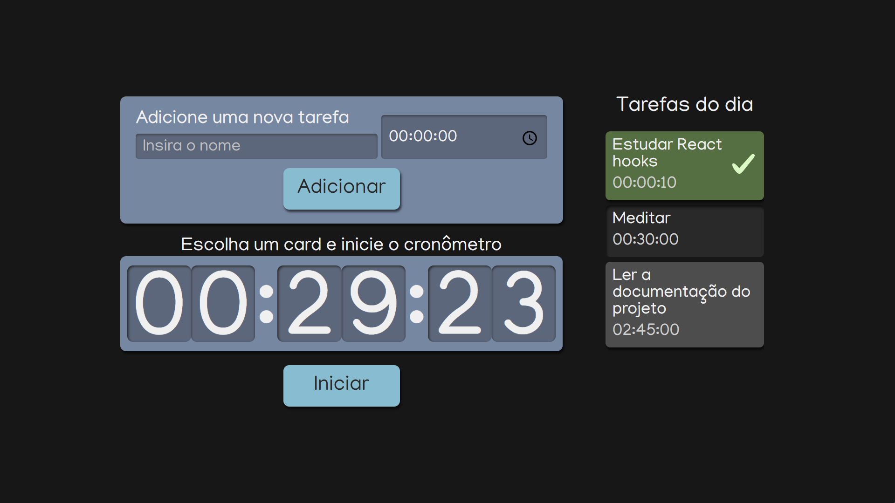

# Task timer

> Task Timer é um projeto que auxilia na organização de tarefas com o tempo definido. É possível adicionar tarefas com um tempo determinado e iniciar um cronômetro para executá-las.

## ☕ Usando Task Timer

Para usar Task Timer, acesse o [link](https://study-timer-blush.vercel.app/).

## 📫 Contribuindo para Task Timer

Para contribuir com Task Timer, siga estas etapas:

1. Bifurque este repositório.
2. Crie um branch: `git checkout -b master`.
3. Faça suas alterações e confirme-as: `git commit -m 'fix/feat: <mensagem curta descrevendo suas alterações>'`
4. Envie para o branch original: `git push origin task-timer`
5. Crie a solicitação de pull.

Como alternativa, consulte a documentação do GitHub em [como criar uma solicitação pull](https://help.github.com/en/github/collaborating-with-issues-and-pull-requests/creating-a-pull-request).

## 📝 Licença

Esse projeto está sob licença. Veja o arquivo [LICENÇA](LICENSE.md) para mais detalhes.

[⬆ Voltar ao topo](#start)
